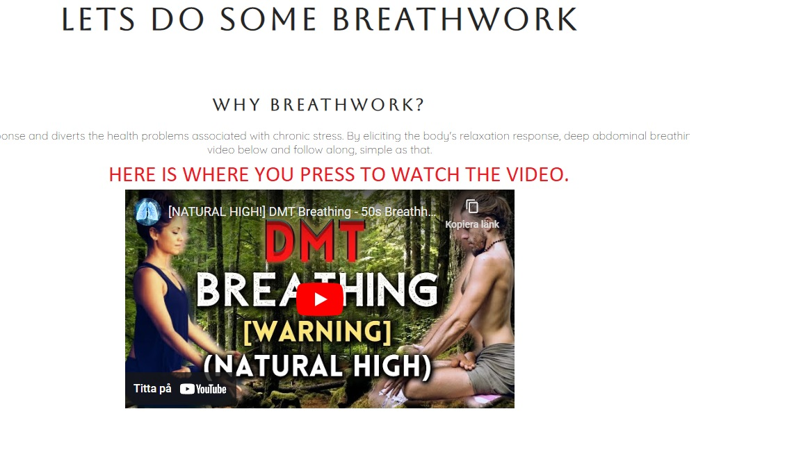
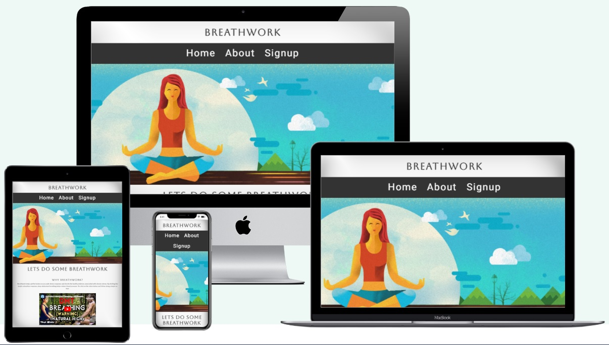

# Breathwork

Simple overview of use/purpose.

## How to
* When you load the page scroll down and read the small description then press play on the video below.
* If you want to know more about breathwork press on the About button in the navigation section.
* To signup press on the signup button in the navigation section, fill in your name, last name and email adress, we contact you.

## Description

The idea of this page is pritty simple, you want to realeve stress by breathing.
I put togheter this page so people can watch the videos i think is best for 
beginners to start practicing breathwork.
The home page is where you find the video section with a small description about it,
The About page is a more in depth description of what breathwork is and the benefits of it.
Then you have the signup page, if you want to become a member of the breathing family.

## Visuals

## Roadmap
In the future i am going to make a zoom section where people can breath togheter, and put some more videos.
The magic happens when we do it togheter.

## Contributing
State if you are open to contributions and what your requirements are for accepting them.

For people who want to make changes to your project, it's helpful to have some documentation on how to get started. Perhaps there is a script that they should run or some environment variables that they need to set. Make these steps explicit. These instructions could also be useful to your future self.

You can also document commands to lint the code or run tests. These steps help to ensure high code quality and reduce the likelihood that the changes inadvertently break something. Having instructions for running tests is especially helpful if it requires external setup, such as starting a Selenium server for testing in a browser.

## Authors and acknowledgment
I have to give a big thanks to Dan from BreathworkBeats for putting up theese videos for free on (https://www.youtube.com/@BreathworkBeats).

## Project status
Sad to  say that development has slowed down because of sickness in the family, i had to put this in a hurry, i realy hope you enjoy it.

## Dependencies

* slack
* Github
* google.fonts
* notebook

## Help

If you are pregnant , have respiratory issues or heart issues please do not do these breathing exercises.
Send me a messege to seblop888@gmail.com if you need help with the technics or got some issues doing the exercises.
Note that i do not take responsibility in any kind, i am just here to help you.

## Acknowledgments

Inspiration, code snippets, etc.
* https://www.webmd.com/balance/what-is-breathwork
* https://www.google.com
* https://fonts.google.com/
* https://www.w3schools.com/
* [https://www.youtube.com](https://www.youtube.com/@BreathworkBeats)
